# 构图研究图文摘录：参考、判断与七轮练习

2026-09-14 · 经 Harper 确认的审阅稿第 09–10 单元。

[返回摘要与来源](README.md) · [可迁移的项目学习](../../06_PROJECT_LEARNINGS/from-aesthetic-preference-to-compositional-judgment-2026-09.md)

图片沿用审阅稿的阅读预览，原文件编号保持一致；不代表原尺寸母版。生成图、圈注和回传选稿分别标明。

## 09 · 关键转折：你想研究的是构图本身

你提出兔子沿花藤“滑下去”，并给出 MARY GARVIN 封面参考。生成图抓住了斜向走势，却加入较大、较亮的兔子及沿途植物。你觉得它不及参考优雅，要求引导分析。

当时分析了三点：参考的花叶集中在顶部，中下段长距离留给细茎；几根线靠得近而间距微变；曲线两边的深色空白完整。助手仍急着把这些发现转成“缩小兔子”的方案。

你明确纠正：“不是兔子的事情 我是想围绕这个构图去分析 什么打动了我 我如何能设计出来这样的感觉的平面。”

这句话是本轮档案的中心。你要练习的是从自身观看感受出发，理解关系，再主动组织画面。讨论之后回到封面本身，不再急着为兔子找位置。

**你圈出的是一整段自然延伸。** 从右上转向斜下，再向左下舒展。你说“这块非常自然延申”。关注范围跨过大弧、小绕结和后续延伸，因此不能把你喜欢的东西缩减成一个漂亮局部。

**你对小绕结的判断：**遮住它，优雅仍然保留；但它使这一处值得细品，也让上下长线更显舒展美丽。助手起初把长线和绕结当作二选一去问，漏掉了两者相互增强的关系。

这里得到的四个构图理解：

1. 舒展需要足够长的距离。转向渐渐发生，中途少量事件，给线条完成动作的空间。
2. 曲线与两侧空白共同构成画面。线与边框距离的变化，塑造了展开、收窄的负形。
3. 局部细密与大尺度长弧相互衬托。整体一眼可读，细节使人愿意停留；停留之后仍能继续。
4. 动势需要版面关系支持。顶部花叶、标题及底部文字等相对稳定区域，与弯曲长茎共同组织画面。此项是当时对该封面的解释，不能推广为每张画都要加上下文字。

**A048 · 参考图 · MARY GARVIN 长弧封面参考**

**A121 · 参考图 · 滑行构想使用的封面参考**

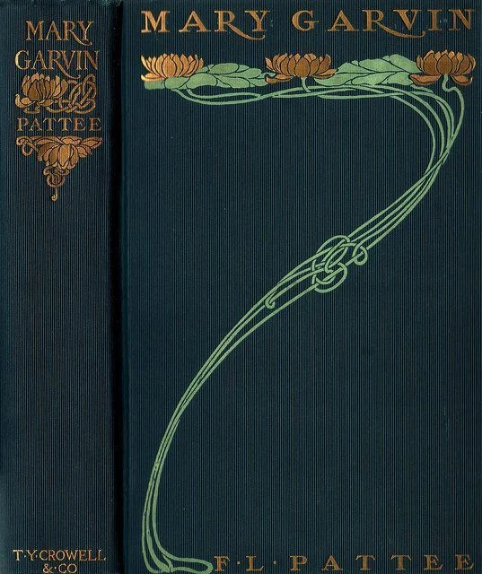

**A123 · 生成图 · 兔子沿花藤滑下的试验**

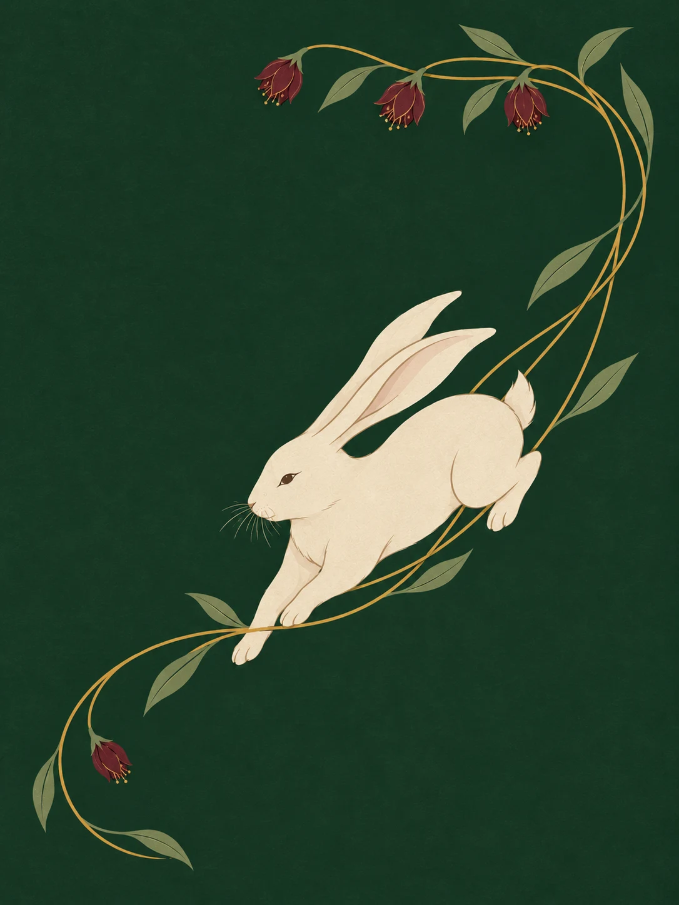

**A124 · 参考图 · 再次回到 MARY GARVIN 封面比较**

**A125 · 草稿与圈注 · Harper 圈注：自然延伸的一整段**

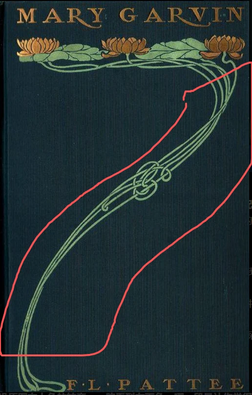

## 10 · 第七组研究：从一条线开始，逐步验证分寸

你上传了自己的单线构图草稿，希望看看助手设计的第一步。随后做了下列实验。每一轮都保留完整构图，并保留生成未严格控制变量的问题。

| 轮次 | 研究问题与实际操作 | 你的判断 | 记录边界 |
|---|---|---|---|
| E01 单线走势 | 三张竖版单线，比较转弯与两侧空白 | “2，更舒服吧自然 其他两张还好” | 这一组更偏好②；不是通用最佳曲线 |
| E02 伴随线间距 | 同样大走势，均匀间距对比缓慢靠拢再分开 | “有一点节奏变化的图2感觉更好呢” | “有一点”很关键；右图一条线上端生成短了，比较有干扰 |
| E03 收紧位置 | 偏上／中间／偏下 | “整体来说还是中间最舒服，偏下位置是第二感觉OK的” | 差异偏弱且弧度也变了，不能证明中央收紧普遍最好 |
| E04 加入小绕结 | 长线对比中部轻微交织 | “图1中间可以更紧凑 图2感觉还好” | 实际只生成轻微交织，未完成清楚回绕；“还好”不等于更喜欢 |
| E05 加强中部收放 | 修改前后并排，中部再靠拢 | 无明确肯定这次调整达到意图 | 助手也承认变化不足，不能当成功版本 |
| E06 用户指定基准 | 你重新上传单张 | “这张最舒服了其实 可以确定” | 确定的是这张构图的整体感受；不能替换成最新生成图 |
| E07 改变起止点 | 以基准为参照，改变线条与边界的关系 | “还是对角线完整一点 01.02像漂浮的” | 当时助手理解为对角伸展更完整、内收更漂浮；原句图号表达含歧义，保留原话及图片核对 |

**对角线与版面边界。** 两端朝右上、左下展开时，线条联系起更大的版面；两端退入内部时，容易成为悬在中央的独立形体。这让“空白越多越好”的说法得到修正：空白的位置和形状，与数量一样重要。

**被确定的基准并非机械整齐。** 某条线上端较短，原来被指出是生成偏差；你后来仍选择了这张整体。不能据此说短线本身已获验证，也不应为了整齐擅自修掉你选稿中的特征。

**可用于自己画图的工作顺序：**先定起止点与整体方向；画长距离、渐进转向的主线；看两侧空白；加伴随线并控制靠近和离开的过渡；最后加入一处值得停留的细节。每一步都回到整张画面判断。

**A128 · 草稿与圈注 · Harper 单线构图小稿**

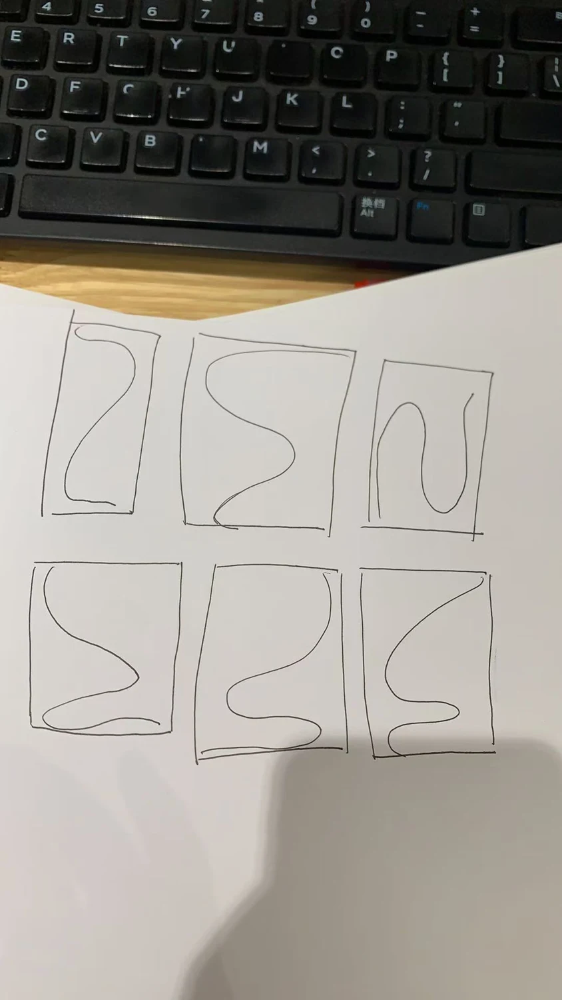

**A129 · 生成图 · E01 · 三种单线走势**

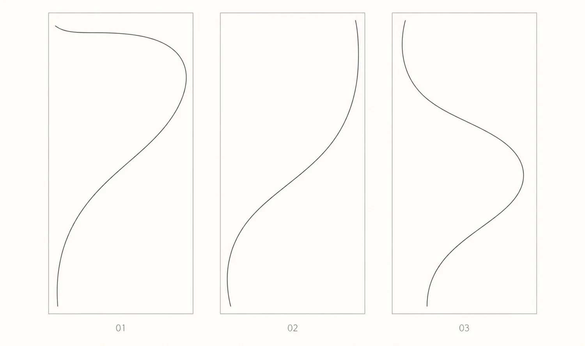

**A130 · 生成图 · E02 · 均匀间距／轻微疏密变化**

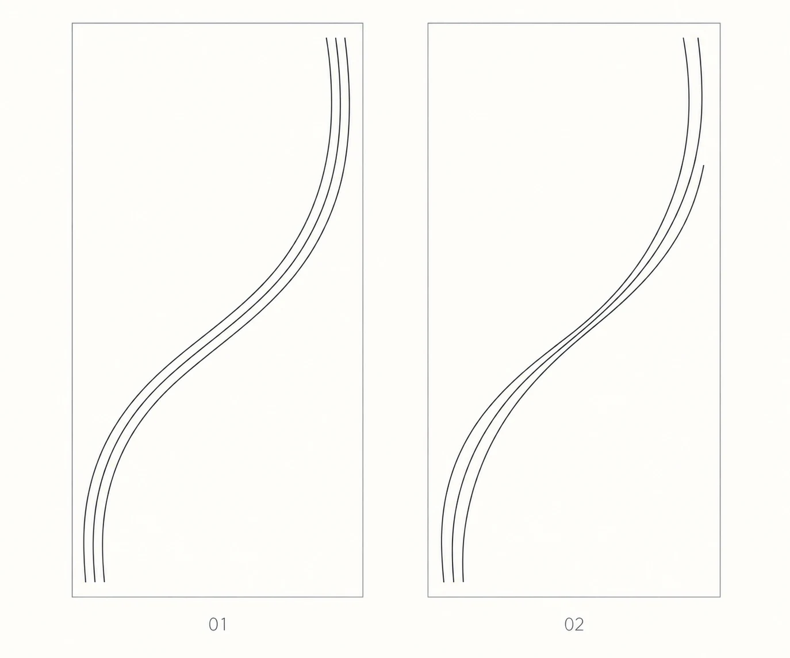

**A131 · 生成图 · E03 · 收紧位置：偏上／中间／偏下**

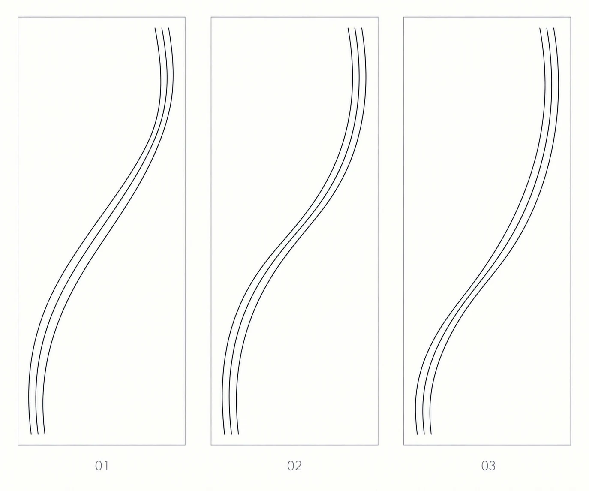

**A132 · 回传与选稿 · 中间收紧版本的单张回传**

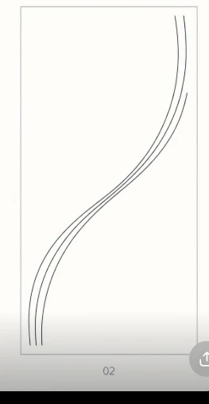

**A133 · 生成图 · E04 · 长线／中部轻微交织**

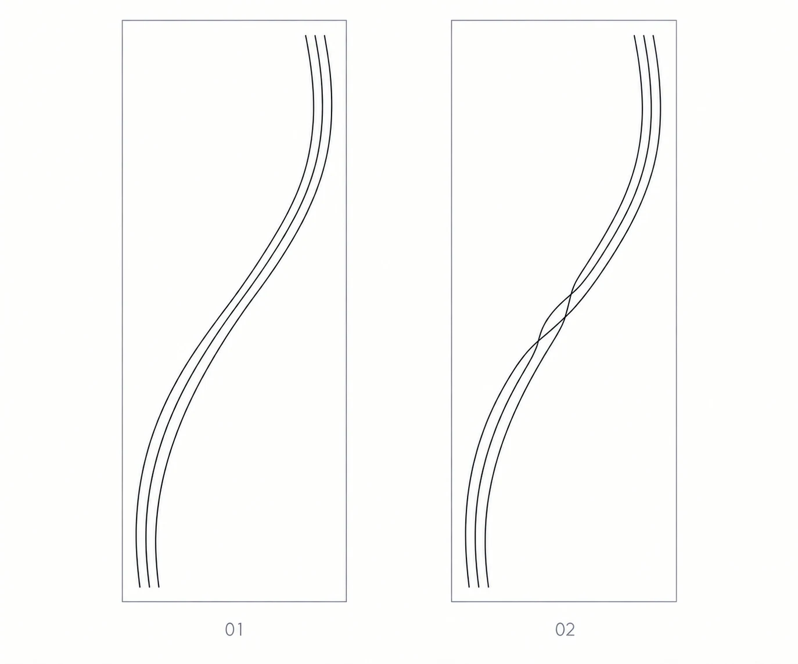

**A134 · 生成图 · E05 · 中段收紧前后比较**

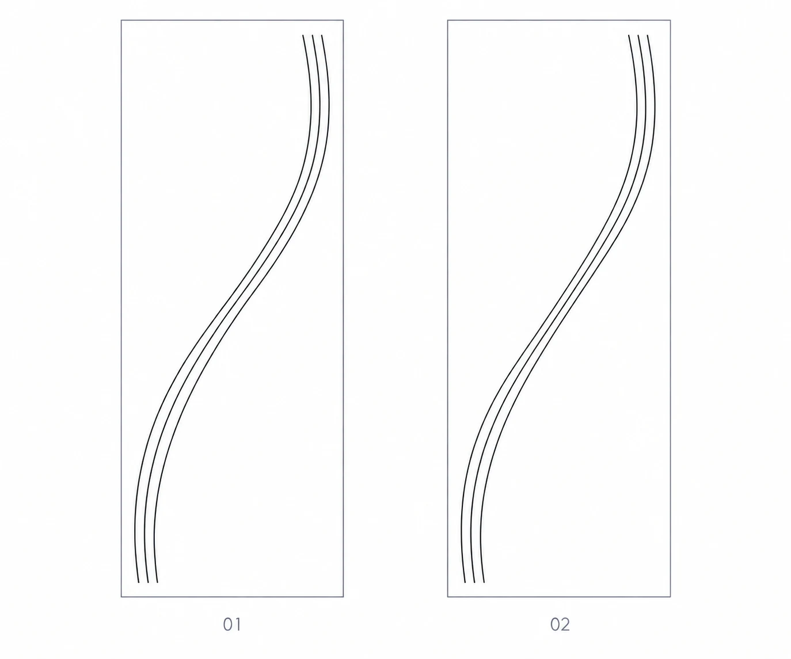

**A135 · 回传与选稿 · E06 · Harper 确定的构图基准回传**

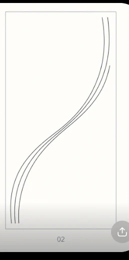

**A136 · 生成图 · E07 · 起止点与对角展开比较**

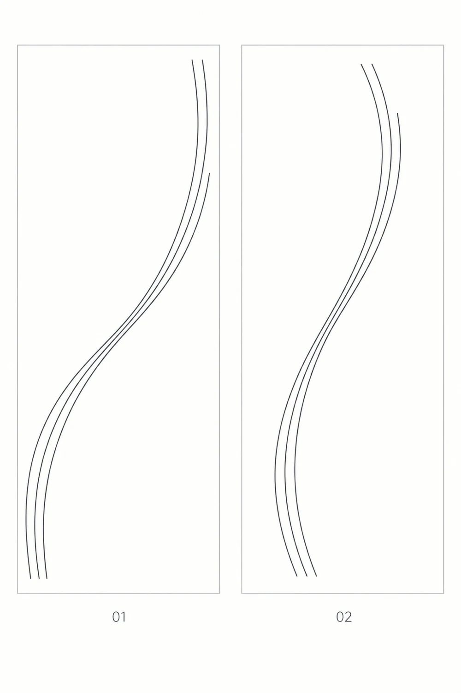

